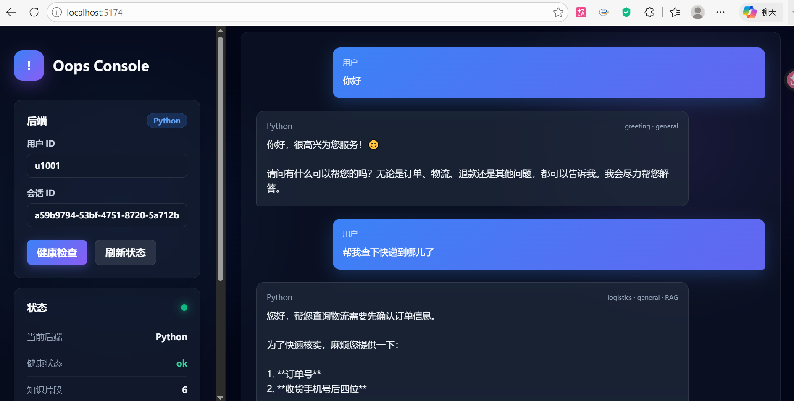
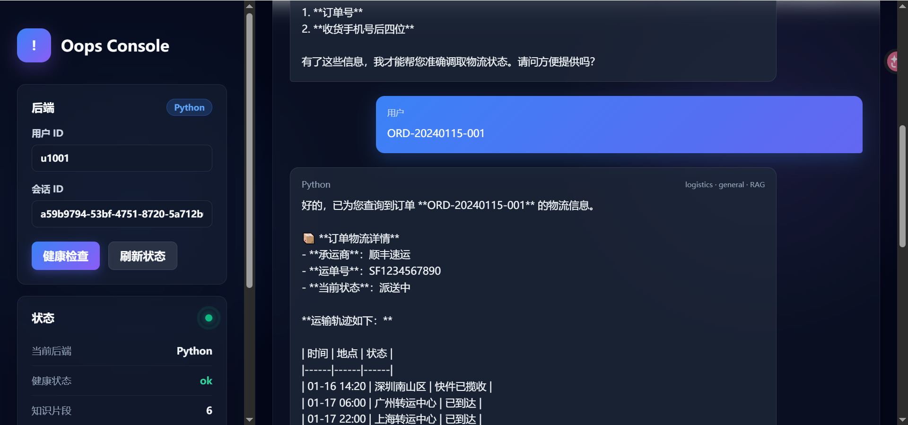
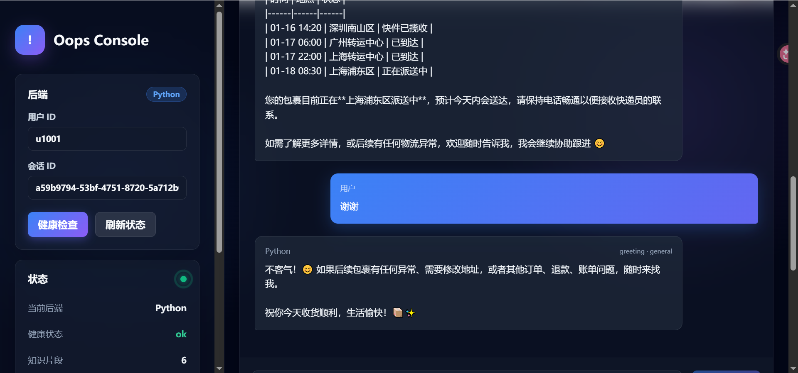

# Oops 完整使用指南

本文档说明 Oops 的部署、启动、API 调用、知识库使用、ChromaDB 数据查看、监控评测和常见排障。

Oops 是一个企业级智能运营助手，核心链路为：

```text
用户请求
  -> FastAPI /chat
  -> MemoryManager 构建四级记忆上下文 (Redis工作记忆 + ChromaDB服务经历/用户画像/用户承诺)
  -> IntentRecognizer 意图识别 (LLM语义/Embedding相似度/Pattern正则 三路融合与降级)
  -> AgentOrchestrator 路由分发 (动态加载专属业务 Skills)
  -> ToolManager 调度工具 (执行查询改写、并行召回、LLM重排、降级与熔断)
  -> LLM 融合各类上下文生成最终回复
  -> MemoryManager 写入当前对话，达到阈值异步压缩持久化至 ChromaDB
```

## 🌟 核心成果展示 (Presentation)

系统在前端交互体验与后端底层机制上均进行了深度优化，以下为真实运行效果及测评数据展示：

### 1. 前端交互效果
系统提供了现代化的高级用户界面，支持暗黑模式以及响应式交互：





### 2. 评测与监控报告
在严格的企业级测评与在线监控下，本系统的底层架构交出了一份优异的答卷。详细的测试结果原始数据可见以下报表：
- 📊 **[端到端多维评测报告 (Evaluation Result)](presentation/evaluation_result.json)**：展示了意图识别准确率、记忆准确度、工具抽取准确度以及 LLM-as-Judge 响应质量的五维得分。
- 📈 **[Agent 路由与工具监控报告 (Monitor Result)](presentation/moniter_result.json)**：包含了三类 Agent 和三大外部工具的线上真实调用次数、成功率及延迟表现。
- 🌲 **[动态技能树注入报告 (Summary Result)](presentation/summery_result.json)**：展示了基于本地知识的动态 SOP 规则实时加载的命中与激活状态。

---

## 1. 项目结构

```text
Oops/
├── api/main.py                    # FastAPI 入口路由
├── core/
│   ├── intent_recognizer.py       # 三路融合意图识别与降级
│   └── skill_loader.py            # 动态业务规则加载
├── agents/agent_orchestrator.py   # 多 Agent 路由与 Prompt 动态编排
├── memory/conversation_memory.py  # 四级记忆管理器 (Redis + ChromaDB)
├── mcp/
│   ├── tool_manager.py            # 高级工具调度 (改写/重排/熔断/缓存)
│   ├── knowledge_base.py          # ChromaDB RAG 知识库检索
│   └── business_tools.py          # 外部系统业务接口模拟对接
├── evaluation/
│   ├── evaluator.py               # LLM-as-Judge 端到端多维质量评测
│   └── memory_evaluator.py        # 记忆准确性专项评测
├── monitor/performance_monitor.py # Agent/工具在线监控与告警
├── frontend/                      # Vue 3 现代化前端交互界面
├── skills/                        # 业务规则与 SOP (Markdown 热加载)
├── data/demo_docs/                # 演示知识库文档
└── docker-compose.yml             # 全栈环境一键编排
```

## 2. 环境准备

### 2.1 必需依赖

- Docker
- Docker Compose
- Anthropic API Key，或兼容 Anthropic 协议的第三方 API Key

### 2.2 配置 `.env`

复制示例文件：

```bash
cp .env.example .env
```

最少需要配置：

```env
ANTHROPIC_API_KEY=your_api_key
```

如果使用 DeepSeek 这类 Anthropic 兼容接口，可以配置：

```env
ANTHROPIC_BASE_URL=https://api.deepseek.com/anthropic
ANTHROPIC_MODEL=deepseek-v4-pro
ANTHROPIC_API_KEY=your_deepseek_key
```

Docker Compose 场景下，Redis 和 ChromaDB 的连接由 `docker-compose.yml` 覆盖为容器内地址。通常不需要手动改：

```env
REDIS_PASSWORD=oops123
CHROMA_HOST=localhost
CHROMA_PORT=8001
```

### 2.3 全栈部署和 run 开发模式的区别

Oops 常用两种 Docker 启动方式：`docker compose up` 全栈部署，以及 `docker run` 开发模式。两者最大的区别是：**全栈部署会同时启动应用和依赖服务；run 开发模式通常只手动运行一个应用容器，依赖服务需要提前启动**。

| 对比项 | Docker Compose 全栈部署 | Docker run 开发模式 |
|--------|--------------------------|----------------------|
| 启动命令 | `docker compose up -d --build` | `docker run ... oops ...` |
| 启动内容 | Oops、Redis、ChromaDB、Prometheus、Nginx | 只启动你指定的单个容器 |
| Redis/ChromaDB | 自动启动并加入同一网络 | 必须先执行 `docker compose up -d redis chromadb` |
| 容器网络 | Compose 自动创建并管理 | 需要手动指定 `--network oops_oops-network` |
| 服务名解析 | 应用可直接访问 `redis`、`chromadb` | 只有加入同一网络后才可访问 `redis`、`chromadb` |
| 代码更新 | 通常需要 rebuild 或重启服务 | 挂载 `-v "$(pwd):/workspace"` 后，代码修改可直接生效，重启容器即可 |
| 适合场景 | 演示、联调、完整部署、HTTP API 服务 | 本地开发、调试 CLI、临时覆盖环境变量 |
| 常见问题 | API Key 或依赖健康检查失败 | 忘记启动 Redis/ChromaDB，导致 `redis:6379 Name or service not known` |

选择建议：

- 想完整体验 HTTP API、Swagger、Nginx、Prometheus：用 **Docker Compose 全栈部署**。
- 想调试源码或 CLI，并且希望本地改代码后快速重跑：用 **Docker run 开发模式**。
- 如果只是跑 CLI，最省心的方式是 `docker compose run --rm oops python api/main.py --cli`，它会自动使用 Compose 网络。

## 3. Docker Compose 全栈部署

推荐使用此方式启动完整服务。

```bash
docker compose up -d --build
```

查看服务状态：

```bash
docker compose ps
```

查看应用日志：

```bash
docker compose logs -f oops
```

看到 Oops 启动日志并且健康检查通过后，服务可用。

启动后的端口：

| 服务 | 容器名 | 宿主机端口 | 容器内端口 | 用途 |
|------|--------|------------|------------|------|
| Oops API | `oops-app` | `8000` | `8000` | 主 API 服务 |
| Nginx | `oops-nginx` | `80` | `80` | 反向代理 |
| ChromaDB | `oops-chromadb` | `8001` | `8000` | 向量数据库 |
| Redis | `oops-redis` | `6379` | `6379` | 工作记忆 |
| Prometheus | `oops-prometheus` | `9090` | `9090` | 监控数据 |

健康检查：

```bash
curl http://localhost:8000/health
```

Swagger 文档：

```text
http://localhost:8000/docs
```

也可以通过 Nginx 访问：

```bash
curl http://localhost/health
```

## 4. Docker Run 开发模式

开发时可以只用 Compose 启动依赖，然后用 `docker run` 挂载当前代码目录。

先启动 Redis 和 ChromaDB：

```bash
docker compose up -d redis chromadb
```

构建镜像：

```bash
docker compose build --no-cache oops
```

启动 HTTP 服务：

```bash
docker run -it --rm \
  --network oops_oops-network \
  -p 8000:8000 \
  -e ANTHROPIC_BASE_URL="https://api.deepseek.com/anthropic" \
  -e ANTHROPIC_API_KEY="your_key" \
  -e ANTHROPIC_MODEL="deepseek-v4-pro" \
  -e REDIS_URL="redis://:oops123@redis:6379/0" \
  -e CHROMA_HOST="chromadb" \
  -e CHROMA_PORT="8000" \
  -e CHROMA_PERSIST_DIRECTORY="/workspace/data/chroma" \
  -v "$(pwd):/workspace" \
  -w /workspace \
  oops
```

CLI 交互模式：

```bash
docker run -it --rm \
  --network oops_oops-network \
  -e ANTHROPIC_BASE_URL="https://api.deepseek.com/anthropic" \
  -e ANTHROPIC_API_KEY="your_key" \
  -e ANTHROPIC_MODEL="deepseek-v4-pro" \
  -e REDIS_URL="redis://:oops123@redis:6379/0" \
  -e CHROMA_HOST="chromadb" \
  -e CHROMA_PORT="8000" \
  -v "$(pwd):/workspace" \
  -w /workspace \
  oops \
  python api/main.py --cli
```

## 14. 停止、重启和清理

停止服务：

```bash
docker compose stop
```

重启服务：

```bash
docker compose restart oops
```

停止并删除容器，但保留数据卷：

```bash
docker compose down
```

停止并删除容器和数据卷：

```bash
docker compose down -v
```

重新构建并启动：

```bash
docker compose up -d --build
```

## 📚 详细文档导航 (Documentation)

为了方便查阅，我们将项目的详细架构说明和 API 参考文档进行了分类归档。**推荐在快速体验后，深入阅读以下文档：**

- 🔗 [API 参考与调用示例 (API Reference)](docs/api_reference.md)
  - 详细的 `/chat`, `/knowledge`, `/monitor`, `/eval` 等接口说明
  - 丰富的 `curl` 调用示例和多轮对话演示
- 🔗 [存储与记忆架构解析 (Memory & Storage)](docs/memory_and_storage.md)
  - 四级记忆架构底层的具体实现机制
  - 如何在 Docker 容器中查看/调试 ChromaDB 和 Redis 数据
- 🔗 [高级特性：评测、监控与工具 (Advanced Features)](docs/advanced_features.md)
  - 端到端评测框架 (LLM-as-Judge) 与 Memory Benchmark 白盒记忆评测引擎
  - MCP 工具调度机制 (改写/缓存/重排/熔断) 与在线监控平台
- 🔗 [常见问题排查 (FAQ)](docs/faq.md)
  - 各类环境报错排查（如 503、Redis 认证失败）与详细的测试验证流程日志\n
