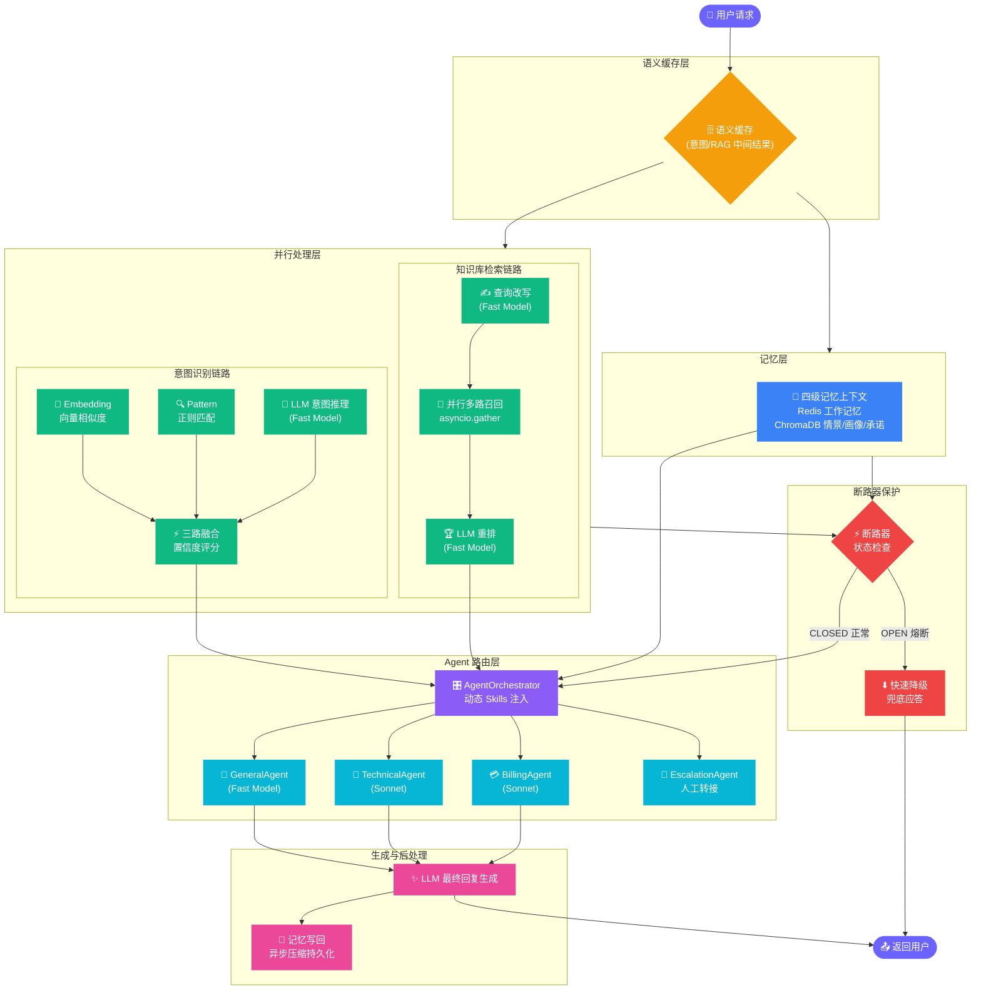

# Oops 完整使用指南

本文档涵盖 Oops 的业务背景、主要功能、部署与启动及常见问题排障。

## 业务痛点与破局之道

相较于传统"套壳 ChatGPT"的智能客服产品，本系统围绕企业客服落地最关键的四个问题——答得准、记得住、回得快又便宜、管得住——进行了系统性攻克：

### 🌟 1. 痛点一：答得准 —— 幻觉、越界承诺与可信度
**问题**：Agent 生成虚假、矛盾或过时的信息，或在信息不足时擅自承诺"肯定退款""马上到账"等未核验结果，轻则答非所问，重则引发投诉与合规风险。

**根本原因**：RAG 检索结果质量参差不齐、模型在检索失败时倾向于自动"补全"而非明确拒答、客服边界缺乏显式约束、歧义输入被直接猜答、上下文存在大量噪声。

**解决方案**：
* **检索优化**：查询改写（Query Rewrite）生成多角度子查询，并行召回后合并去重，再用 LLM 重排（Rerank）提升相关性
* **可信度门槛与拒答**：检索片段按置信度阈值过滤，无高置信命中时明确拒答"知识库中未找到相关信息"并禁止编造
* **兜底追问**：意图识别置信度不足时先澄清需求，避免在歧义输入上猜答
* **合规边界动态注入**：将退款、发票、排障等场景的禁止事项固化为 Skills，随意图与关键词动态注入 system prompt，约束越界承诺与敏感信息索取
* **多 Agent 领域拆分**：复合诉求（如"登录故障 + 重复扣款"）拆给技术/账单 Agent 并行处理再合并，避免单一 Agent 答偏
* **槽位提取**：提取订单号等关键槽位（Slot）并结构化注入上下文，降低模型在长文本中漏读、误读的概率

### 🌟 2. 痛点二：记得住 —— 多轮失忆与上下文碎片化
**问题**：客服是多轮任务，Agent 忘记前文订单号、反复索要信息、用户纠正后仍沿旧路径回答，跨会话无法延续用户偏好与服务记录。

**根本原因**：上下文无限堆积导致超长与噪声；历史仅靠会话内缓存、无法跨会话检索；用户偏好与承诺缺乏长期存储；压缩过程可能丢失关键槽位。

**解决方案**：
* **四级记忆架构**：Redis 工作记忆承载最近对话（毫秒级读写），ChromaDB 承载情景记忆（跨会话语义检索）、用户画像（长期偏好演进）与用户承诺
* **上下文压缩**：工作记忆超阈值后用 LLM 提炼服务记录（核心槽位、处理流程、解决状态），保留摘要与最近 5 条，防止上下文爆炸
* **画像动态演进**：异步从对话中提炼沟通风格、技术水平与偏好，用户能力或偏好变化时覆盖旧标签
* **承诺状态机**：服务承诺支持超时判定，超时自动标记过期并提示转人工，闭环完成后解除干预
* **记忆专项评测**：Memory Benchmark 白盒验证压缩保真度（槽位召回）、检索准确率与画像演进，防止"记忆扭曲"或"失忆"

### 🌟 3. 痛点三：回得快又便宜 —— 延迟、成本与雪崩
**问题**：LLM 推理慢、Token 贵，高并发下请求排队使吞吐量雪崩式下降，规模化落地受阻。

**根本原因**：串联架构各阶段延迟逐级叠加；重复查询反复消耗 LLM；昂贵旗舰模型被无差别高频调用；超长上下文持续累积。

**解决方案**：
* **异步并行**：意图识别与知识库检索解耦并行；意图内 LLM 推理与 Embedding 并行；RAG 多路子查询异步并发召回
* **熔断降级**：检索超过 10 秒触发单次降级兜底；同一工具连续失败 5 次熔断，防止雪崩扩散
* **语义缓存**：对重复查询的意图识别与 RAG 检索中间结果做语义缓存，命中后跳过改写、重排与 Embedding 计算
* **上下文压缩**：历史消息提炼为"用户画像 + 服务总结"，大幅缩减 Prompt 长度
* **强制输出约束**：通过 `max_tokens` 限制生成长度，并用结构化格式约束杜绝无效 Token 输出
* **混合模型路由**：简单任务（意图、改写、重排、通用接待）走快速模型，复杂任务（技术、账单、升级）走旗舰模型，分级控制成本

### 🌟 4. 痛点四：管得住 —— 效果不可知与运营难
**问题**：LLM 客服是黑盒，效果难量化、线上劣化难发现、业务规则变更上线慢、问题难追溯，导致不敢上线、无法迭代。

**根本原因**：缺少评测基准与回归检测；缺少线上指标与告警；规则变更依赖研发改代码；缺少端到端追踪与审计依据。

**解决方案**：
* **LLM-as-Judge 评测**：从相关性、准确性、完整性、有用性、合规性五维打分，自动对比历史基线做回归检测
* **专项评测**：工具参数提取准确率、记忆压缩/检索/演进专项白盒评测，覆盖组件级质量
* **在线监控与路由反馈**：实时采集 Agent 与工具的成功率、延迟、熔断状态，Z-score 检测指标突变，并将表现写回路由评分，自动绕开劣化实例
* **Skills 热加载**：业务话术、SOP、合规边界以 Markdown 管理，运行时 `/skills/reload` 即时生效，运营无需发版
* **可审计输出**：接口结构化返回路由依据、置信度、知识引用与实体信息，配合日志与 Prometheus 指标留存处理线索

## 系统流程图



> 说明：语义缓存当前作用于意图识别与 RAG 检索的中间结果，命中后跳过重复的改写/重排/Embedding 计算，但最终回复仍由 Agent 生成，不会直接“100ms 原样返回”整条对话结果。
>
> 另：意图识别的“Embedding 向量相似度”一路，在未接入远端 Embedding 服务时使用本地字符 n-gram 哈希向量兜底（不依赖外部 Embedding API），语义能力有限，代码中已明确标注。

## 项目预览
### 1. 前端交互效果
系统提供了现代化的高级用户界面，支持暗黑模式以及响应式交互：


### 2. 评测与监控报告 
-  **[端到端多维评测报告 (Evaluation Result)](presentation/evaluation_result.json)**：展示了意图识别准确率、记忆准确度、工具抽取准确度以及 LLM-as-Judge 响应质量的五维得分。
-  **[Agent 路由与工具监控报告 (Monitor Result)](presentation/moniter_result.json)**：包含了三类 Agent 和三大外部工具的线上真实调用次数、成功率及延迟表现。
-  **[动态技能树注入报告 (Summary Result)](presentation/summery_result.json)**：展示了基于本地知识的动态 SOP 规则实时加载的命中与激活状态。


---
## 1. 项目结构

```text
Oops/
├── api/main.py                    # FastAPI 入口路由
├── core/
│   ├── intent_recognizer.py       # 三路融合意图识别与降级
│   └── skill_loader.py            # 动态业务规则加载
├── agents/agent_orchestrator.py   # 多 Agent 路由与 Prompt 动态编排
├── memory/conversation_memory.py  # 四级记忆管理器 (Redis + ChromaDB)
├── mcp/
│   ├── tool_manager.py            # 高级工具调度 (改写/重排/熔断/缓存)
│   ├── semantic_cache.py          # 语义缓存
│   ├── knowledge_base.py          # ChromaDB RAG 知识库检索
│   └── business_tools.py          # 外部系统业务接口模拟对接
├── evaluation/
│   ├── evaluator.py               # LLM-as-Judge 端到端多维质量评测
│   └── memory_evaluator.py        # 记忆准确性专项评测
├── monitor/performance_monitor.py # Agent/工具在线监控与告警
├── frontend/                      # Vue 3 现代化前端交互界面
├── skills/                        # 业务规则与 SOP (Markdown 热加载)
├── data/demo_docs/                # 演示知识库文档
└── docker-compose.yml             # 全栈环境一键编排
```

## 2. 环境准备

### 2.1 必需依赖

- Docker
- Docker Compose
- Anthropic API Key，或兼容 Anthropic 协议的第三方 API Key

### 2.2 配置 `.env`

复制示例文件：

```bash
cp .env.example .env
```

最少需要配置：

```env
ANTHROPIC_API_KEY=your_api_key
```

如果使用 DeepSeek 这类 Anthropic 兼容接口，可以配置：

```env
ANTHROPIC_BASE_URL=https://api.deepseek.com/anthropic
ANTHROPIC_MODEL=deepseek-v4-pro
ANTHROPIC_API_KEY=your_deepseek_key
```

Docker Compose 场景下，Redis 和 ChromaDB 的连接已由 `docker-compose.yml` 强制覆盖为容器内地址（`redis:6379`、`chromadb:8000`），因此即使 `.env` 里写的是 `localhost` 也不会影响 Compose 全栈部署。只有本地直跑（不用 Compose）时才需要把 `CHROMA_HOST/CHROMA_PORT` 指向本地服务：

```env
REDIS_PASSWORD=oops123
CHROMA_HOST=localhost
CHROMA_PORT=8001
```

### 2.3 全栈部署和 run 开发模式的区别

Oops 常用两种 Docker 启动方式：`docker compose up` 全栈部署，以及 `docker run` 开发模式。两者最大的区别是：**全栈部署会同时启动应用和依赖服务；run 开发模式通常只手动运行一个应用容器，依赖服务需要提前启动**。

| 对比项 | Docker Compose 全栈部署 | Docker run 开发模式 |
|--------|--------------------------|----------------------|
| 启动命令 | `docker compose up -d --build` | `docker run ... oops ...` |
| 启动内容 | Oops、Redis、ChromaDB、Prometheus、Nginx | 只启动你指定的单个容器 |
| Redis/ChromaDB | 自动启动并加入同一网络 | 必须先执行 `docker compose up -d redis chromadb` |
| 容器网络 | Compose 自动创建并管理 | 需要手动指定 `--network oops_oops-network` |
| 服务名解析 | 应用可直接访问 `redis`、`chromadb` | 只有加入同一网络后才可访问 `redis`、`chromadb` |
| 代码更新 | 通常需要 rebuild 或重启服务 | 挂载 `-v "$(pwd):/workspace"` 后，代码修改可直接生效，重启容器即可 |
| 适合场景 | 演示、联调、完整部署、HTTP API 服务 | 本地开发、调试 CLI、临时覆盖环境变量 |
| 常见问题 | API Key 或依赖健康检查失败 | 忘记启动 Redis/ChromaDB，导致 `redis:6379 Name or service not known` |

选择建议：

- 想完整体验 HTTP API、Swagger、Nginx、Prometheus：用 **Docker Compose 全栈部署**。
- 想调试源码或 CLI，并且希望本地改代码后快速重跑：用 **Docker run 开发模式**。
- 如果只是跑 CLI，最省心的方式是 `docker compose run --rm oops python api/main.py --cli`，它会自动使用 Compose 网络。

## 3. Docker Compose 全栈部署

推荐使用此方式启动完整服务。

```bash
docker compose up -d --build
```

查看服务状态：

```bash
docker compose ps
```

查看应用日志：

```bash
docker compose logs -f oops
```

看到 Oops 启动日志并且健康检查通过后，服务可用。

启动后的端口：

| 服务 | 容器名 | 宿主机端口 | 容器内端口 | 用途 |
|------|--------|------------|------------|------|
| Oops API | `oops-app` | `8000` | `8000` | 主 API 服务 |
| Nginx | `oops-nginx` | `80` | `80` | 反向代理 |
| ChromaDB | `oops-chromadb` | `8001` | `8000` | 向量数据库 |
| Redis | `oops-redis` | `6379` | `6379` | 工作记忆 |
| Prometheus | `oops-prometheus` | `9090` | `9090` | 监控数据 |

健康检查：

```bash
curl http://localhost:8000/health
```

Swagger 文档：

```text
http://localhost:8000/docs
```

也可以通过 Nginx 访问：

```bash
curl http://localhost/health
```

## 4. Docker Run 开发模式

开发时可以只用 Compose 启动依赖，然后用 `docker run` 挂载当前代码目录。

先启动 Redis 和 ChromaDB：

```bash
docker compose up -d redis chromadb
```

构建镜像：

```bash
docker compose build --no-cache oops
```

启动 HTTP 服务：

```bash
docker run -it --rm \
  --network oops_oops-network \
  -p 8000:8000 \
  -e ANTHROPIC_BASE_URL="https://api.deepseek.com/anthropic" \
  -e ANTHROPIC_API_KEY="your_key" \
  -e ANTHROPIC_MODEL="deepseek-v4-pro" \
  -e REDIS_URL="redis://:oops123@redis:6379/0" \
  -e CHROMA_HOST="chromadb" \
  -e CHROMA_PORT="8000" \
  -e CHROMA_PERSIST_DIRECTORY="/workspace/data/chroma" \
  -v "$(pwd):/workspace" \
  -w /workspace \
  oops
```

CLI 交互模式：

```bash
docker run -it --rm \
  --network oops_oops-network \
  -e ANTHROPIC_BASE_URL="https://api.deepseek.com/anthropic" \
  -e ANTHROPIC_API_KEY="your_key" \
  -e ANTHROPIC_MODEL="deepseek-v4-pro" \
  -e REDIS_URL="redis://:oops123@redis:6379/0" \
  -e CHROMA_HOST="chromadb" \
  -e CHROMA_PORT="8000" \
  -v "$(pwd):/workspace" \
  -w /workspace \
  oops \
  python api/main.py --cli
```

## 14. 停止、重启和清理

停止服务：

```bash
docker compose stop
```

重启服务：

```bash
docker compose restart oops
```

停止并删除容器，但保留数据卷：

```bash
docker compose down
```

停止并删除容器和数据卷：

```bash
docker compose down -v
```

重新构建并启动：

```bash
docker compose up -d --build
```

## 📚 详细文档导航 (Documentation)

为了方便查阅，我们将项目的详细架构说明和 API 参考文档进行了分类归档。**推荐在快速体验后，深入阅读以下文档：**

- 🔗 [API 参考与调用示例 (API Reference)](docs/api_reference.md)
  - 详细的 `/chat`, `/knowledge`, `/monitor`, `/eval` 等接口说明
  - 丰富的 `curl` 调用示例和多轮对话演示
- 🔗 [存储与记忆架构解析 (Memory & Storage)](docs/memory_and_storage.md)
  - 四级记忆架构底层的具体实现机制
  - 如何在 Docker 容器中查看/调试 ChromaDB 和 Redis 数据
- 🔗 [高级特性：评测、监控与工具 (Advanced Features)](docs/advanced_features.md)
  - 端到端评测框架 (LLM-as-Judge) 与 Memory Benchmark 白盒记忆评测引擎
  - MCP 工具调度机制 (改写/缓存/重排/熔断) 与在线监控平台
- 🔗 [常见问题排查 (FAQ)](docs/faq.md)
  - 各类环境报错排查（如 503、Redis 认证失败）与详细的测试验证流程日志\n
